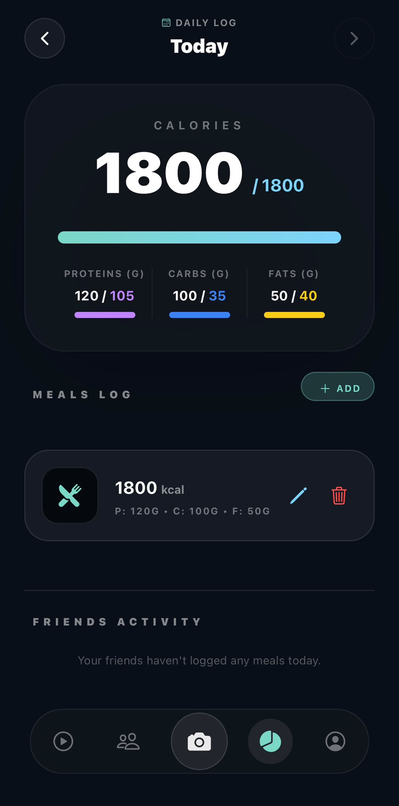
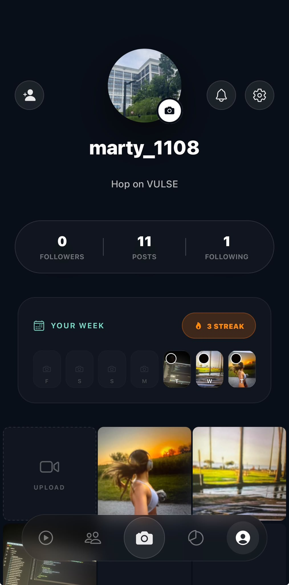
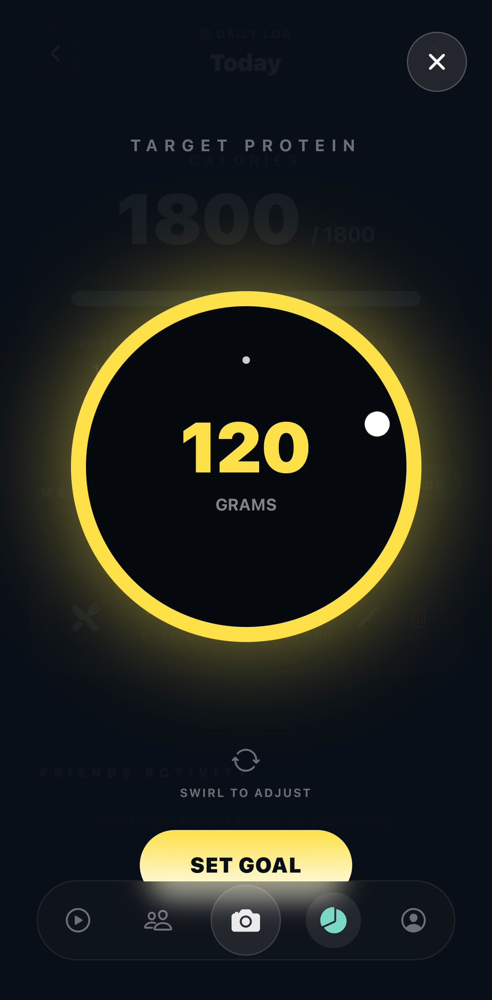

# Vulse - The Active Lifestyle App ⚡
 
Forget endless, passive doom-scrolling. Vulse is a social platform built specifically for the health and fitness community: a place to share authentic dual-camera daily moments with your close friends circle, track your daily nutrition, and explore short-form fitness & active lifestyle content from creators you love.

---

## 📸 See It In Action

| Feed | Camera & AI Analysis |
| :---: | :---: |
|  |  |
| **Profile & Visual Calendar** | **Liquid Glass UI** |
|  |  |

---

## 💻 The Tech Stack

* **Core Backend:** Java 26, Spring Boot 4, Spring Security (Stateless JWT).
* **Database & ORM:** PostgreSQL with Hibernate / Spring Data JPA.
* **Mobile App:** React Native via Expo, TypeScript, NativeWind for styling.
* **External APIs:** Cloudinary (for optimized media streaming) 

---
